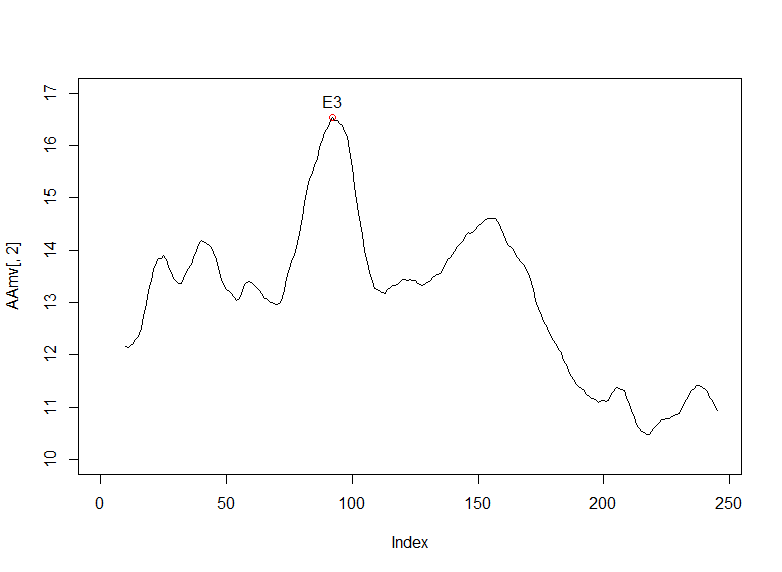
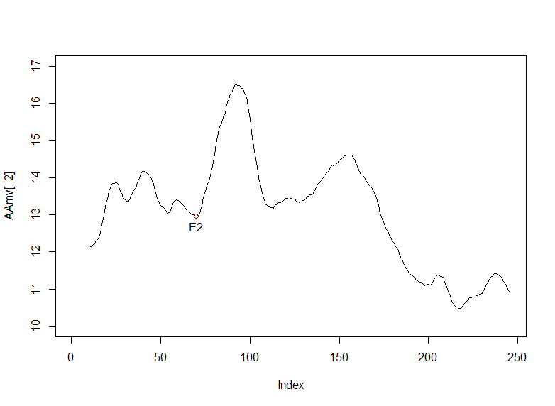
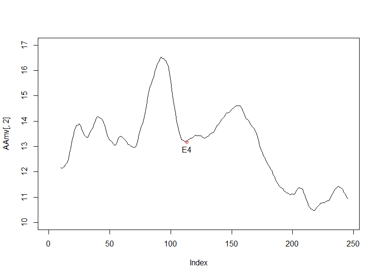
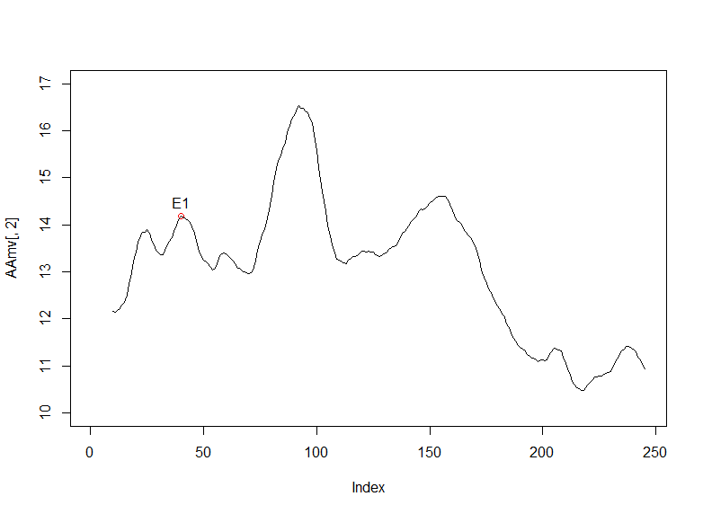
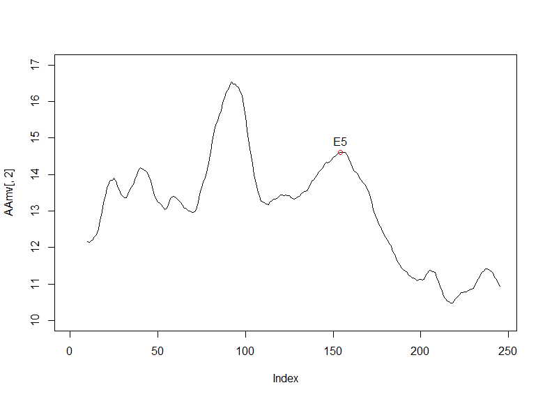
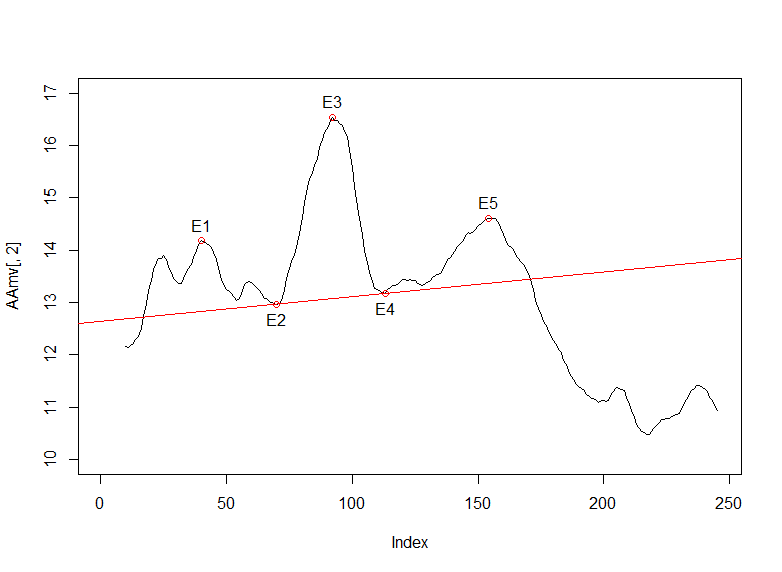

# Head Shoulder Pattern Identification in R
## Identify head-shoulder pattern of S&P500

### 1 Find 5 Points for Head and Shoulder

To identify a head-shoulder pattern, we should write a function to find
extreme values. For this question, the function to find extreme max
value and extreme min value should be separated. The extreme max value
is defined in a simple way: if the value is bigger than the previous one
and following one, it is an extreme max value. Or, if it is the first
one and bigger the next one and it is the last one and bigger than the
previous one, it is also an extreme max value. The same as the extreme
min value.

The original data is too noisy, because there are many extreme values in
a short time. To solve this problem, we should calculate moving average
instead of original data. In this problem, **the n for moving average is
10**.

E3 is easy to obtain, because it is the biggest one. The result shows it
is the 92-th value, which is 16.538.

Then, we use the function to find extreme min values. E2 and E4 are
located on both sides of E3, so we should find them separately by
dividing the range by E3.

In the range of time 1 to time 92, there are 4 points left after the
first filtration. And there are only 2 left after the second filtration:
(11, 12.131), (70, 12.972). Obviously, (11, 12.131) is the first point,
so it must not be E2, indicating (70, 12.972) is E2.

In the range of time 92 to the end, there are 12 points left after the
first filtration. And there are 4 left after the second filtration and 2
left after the third filtration: (113, 13.176), (218, 10.474).
Obviously, (218, 10.474) is too far away from E3, so it must not be E4,
indicating (113, 13.176) is E4.

Then, we use another function to find extreme max values. Also, we
should find them separately by dividing the range by E3.

In the range of time 1 to time 92, There are 5 points left after the
first filtration. And there are only 2 left after the second filtration:
(40, 14.183), (92, 16.538). Since (92, 16.538) is E3, (40, 14.183) must
be E1.

In the range of time 92 to the end, there are 12 points left after the
first filtration. And there are 5 left after the second filtration and 3
left after the third filtration: (92, 16.538), (154, 14.611),

(157, 14.611). Besides E3, there are 2 points with the same values. Both
points can be E5, so we choose the first one (154, 14.611) as E5.

To identify HaS pattern, E1 and E5 must be within 1.5% of their average.
So are E2 and E4.

For E1(40, 14.183) and E5(154, 14.611), their values should be within
(14.18104, 14.61295), and that is true.

For E2(70, 12.972) and E4(113, 13.176), their values should be within
(12.87789, 13.27011), and that is also true.

In conclusion, the HaS pattern with E1, E2, E3, E4, E5 can be confirmed.

### 2 Draw Neckline

After that, the neckline can be computed by E2 and E4. Slope and
intercept are available:

slope = (12.972  - 13.176) /(70  - 113)

intercept =  12.972  -  70 * slope

The line can be drawn by abline(intercept, slope, col = \"red\")

### 3 Use the Pattern to Make Suggestion

To identify the price objective, we need to calculate the distance
between E3 and neckline. Then, figure out the first time that the price
drops below the neckline.

The neckline can be defined as:
NkValue =  slope * x  +  intercept, hence, the distance can be
obtained: distance = 16.538 - (slope * 92  +  intercept) = 3.46.

The first time that the price drops below the neckline is
171(**2010-05-05**), so it is the time to sell the stock.

Also, the price objective can be calculated:
slope * 171  +  intercept -  distance = 9.99. **Assume that we
don't know what will happen after 171(2010-05-05), we should sell at
that time and close position when the price drops to 9.99.**
